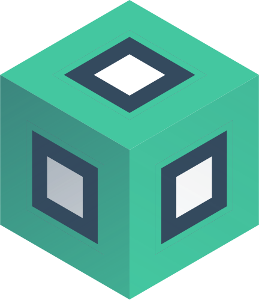

# What Is Vue Blox?

Vue Blox was designed to solve the problem of rendering dynamic user-generated content while constraining that content to a selection of specific Vue components. If you've ever integrated the Slack API into one of your projects, Vue Blox is very similar to Slack's [BlockKit API](https://www.google.com/url?sa=t&rct=j&q=&esrc=s&source=web&cd=&cad=rja&uact=8&ved=2ahUKEwiZ3Ljc4vn7AhVGheAKHbCQB6QQFnoECA0QAQ&url=https://api.slack.com/block-kit&usg=AOvVaw3968Lct0SGECMdK_62GKu0), with a little more power (2-way data binding, mustache templates, plugin support, etc.).

In it's simplest form, Vue Blox allows you to:

- Optionally register Vue Blox globally within your Vue application, via the [registerBlox](/docs/api/composables/register-blox) composable.
- Create a [BloxCatalog](/docs/api/classes/blox-catalog) of Vue components, where each component is mapped to a specific string identifier, via the [getBloxCatalog](/docs/api/composables/get-blox-catalog) composable.
- Create a [BloxBindings](/docs/api/classes/blox-bindings) instance storing reactive references to mutable (v-model) props within a subset of these components, via the [getBloxBindings](/docs/api/composables/get-blox-bindings) composable.
- Create a [BloxView](/docs/api/classes/blox-view) view model describing the subset of components you wish to render, including props to provide to those views, props that should be bound to your BloxBindings, and nested components to insert into slots of those components, via the [getBloxView](/docs/api/composables/get-blox-view) composable.
- Pass your BloxCatalog, BloxBindings, and BloxView instances to a [BloxComponent](/docs/api/components/blox-component) to render the components defined in your view / catalog, mapped to your bindings.
